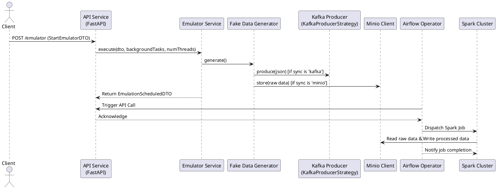
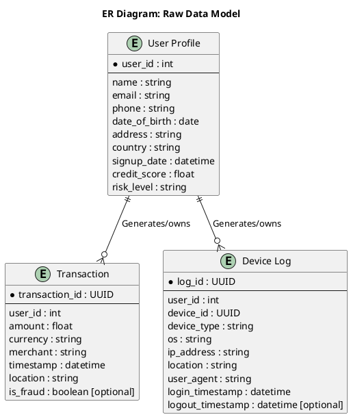

# Lakehouse Lab: Data Emulator & Pipeline Architecture Documentation

Lakehouse Lab is an open, extensible platform designed to simulate realistic data ingestion workflows. It enables users to generate synthetic data across multiple domains, stream data into storage systems, and process it through data transformation pipelines. This documentation details the system's architecture, components, data flows, and relational models.

---

## Table of Contents

1. [Introduction](#introduction)
2. [System Architecture Overview](#system-architecture-overview)
3. [Data Factories](#data-factories)
    - [DeviceLogFactory](#devicelogfactory)
    - [TransactionFakeFactory](#transactionfakefactory)
    - [UserProfileFactory](#userprofilefactory)
4. [API Workflow & Data Ingestion](#api-workflow--data-ingestion)
5. [Orchestration and Spark Processing](#orchestration-and-spark-processing)
6. [Diagrams](#diagrams)
    - [Sequence Diagram](#sequence-diagram)
    - [ER Diagram (Raw Data Model)](#er-diagram-raw-data-model)

---

## Introduction

Lakehouse Lab emulates a robust data ingestion and processing environment for modern data architectures. The platform simulates the data production lifecycle—from synthetic record generation to advanced processing—facilitating testing, development, and analytics at scale. The solution is built using modern technologies such as Kafka, Minio, Apache Airflow, and Apache Spark.

---

## System Architecture Overview

Lakehouse Lab’s architecture is segmented into three primary areas:

- **Data Generation:** Synthetic data is produced using dedicated data factories, each targeting a specific domain (e.g., user profiles, transactions, device logs).
- **Data Ingestion:** The synthetic data is ingested into raw storage via either message brokers (Kafka) or object storage (Minio).
- **Data Processing:** Downstream processes orchestrated by Apache Airflow trigger Apache Spark jobs. These jobs transform raw data into analytics-ready layers (Bronze, Silver, and Gold).

This modular design ensures extensibility and ease of maintenance while replicating realistic data ingestion workflows.

---

## Data Factories

Each factory is responsible for generating realistic synthetic data for a specific domain. All factories expose similar metadata so that downstream processes can treat data uniformly.

### DeviceLogFactory

- **Purpose:**
  Generates synthetic device log records capturing information such as user device details, login/logout timestamps, and network specifics.
- **Key Fields:**
  - `log_id`
  - `user_id`
  - `device_id`
  - `device_type`
  - `os`
  - `ip_address`
  - `location`
  - `user_agent`
  - `login_timestamp`
  - `logout_timestamp` *(optional)*

### TransactionFakeFactory

- **Purpose:**
  Produces synthetic financial transaction data, including optional fraud indicators.
- **Key Fields:**
  - `transaction_id`
  - `user_id`
  - `amount`
  - `currency`
  - `merchant`
  - `timestamp`
  - `location`
  - `is_fraud` *(optional)*
- **Fraud Rules:**
  Incorporates logic based on user compromise, card testing, merchant collusion, geographical anomalies, and an inherent fraud probability.

### UserProfileFactory

- **Purpose:**
  Generates synthetic user profiles, incorporating demographic and risk assessment data.
- **Key Fields:**
  - `user_id`
  - `name`
  - `email`
  - `phone`
  - `date_of_birth`
  - `address`
  - `country`
  - `signup_date`
  - `credit_score`
  - `risk_level`

---

## API Workflow & Data Ingestion

The Data Emulator Service provides a RESTful API to initiate data emulation. The following outlines the typical workflow:

### Request Initiation

An external client sends a POST request to the FastAPI endpoint. For example:

```bash
curl -X 'POST' 'http://localhost:8000/emulator/' \
  -H 'Content-Type: application/json' \
  -d '{"emulator_sync": "minio", "emulation_domain": "user-profile", "timeout": 120}'
```

### Processing Steps

1. **Endpoint Invocation:**
   The FastAPI receives a `StartEmulatorDTO` payload with parameters such as the destination type (Kafka or Minio), the data domain, and an optional timeout.

2. **Factory Selection & Task Scheduling:**
   Based on the `emulation_domain`, the correct data factory (e.g., `UserProfileFactory`) is selected. A background task is scheduled with the specified timeout.

3. **Data Generation & Ingestion:**
   The factory continuously generates synthetic data:
   - For `emulator_sync` set to `"kafka"`: Data is published as JSON messages to Kafka.
   - For `emulator_sync` set to `"minio"`: Raw records are stored within a Minio bucket.

4. **Response Generation:**
   The service responds with an `EmulationScheduledDTO` that includes a unique emulation ID and execution details.

5. **Triggering Downstream Processing:**
   An Airflow operator may later trigger the API to indicate completion. Subsequently, Apache Spark jobs are dispatched to read, transform, and store the processed data.

---

## Orchestration and Spark Processing

### Airflow Orchestration

- **Role:**
  Airflow is responsible for scheduling and managing the lifecycle of data emulation tasks. Once a task is completed, Airflow initiates subsequent Spark processing jobs.

### Apache Spark Processing

- **Role:**
  Apache Spark is used for both batch and stream processing:
  - **Batch Jobs:** Regularly process raw data stored in Minio or received via Kafka.
  - **Streaming Jobs:** Continuously process incoming data (if required).
- **Pipeline Layers:**
  The processed data is organized into multiple layers:
  - **Bronze:** Raw ingested data.
  - **Silver:** Cleaned and pre-aggregated data.
  - **Gold:** Curated, analytics-ready datasets.

---

## Diagrams

### Sequence Diagram

This diagram shows the interactions between system components during a typical data emulation workflow.



### ER Diagram (Raw Data Model)

The following ER diagram represents the relational structure of the raw data generated by the data factories.



---
