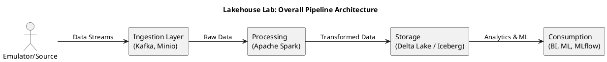
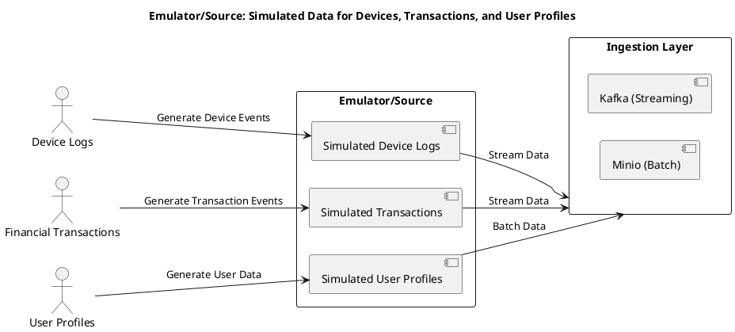
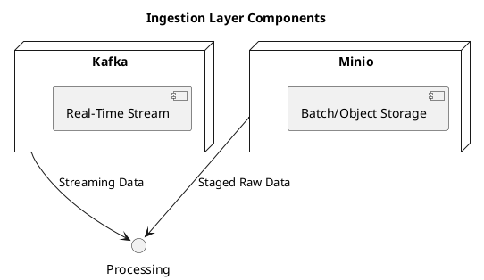
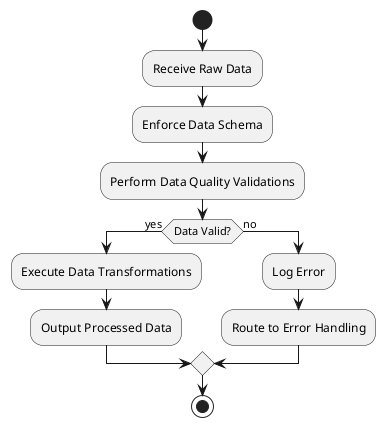
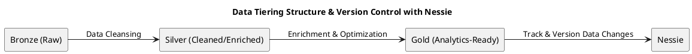
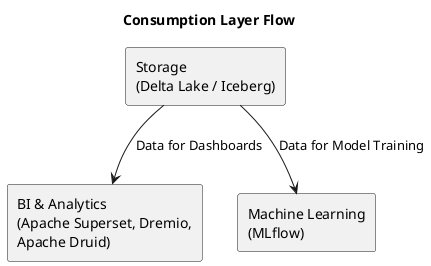
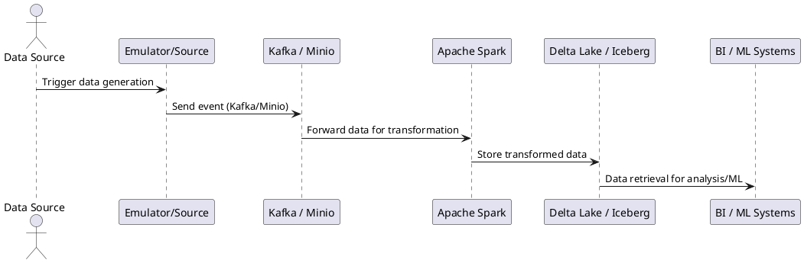
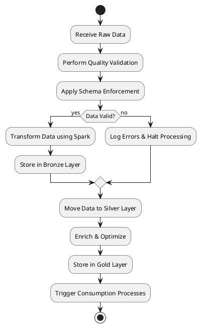
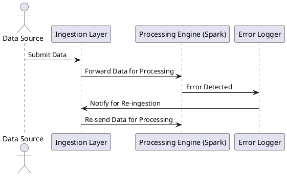
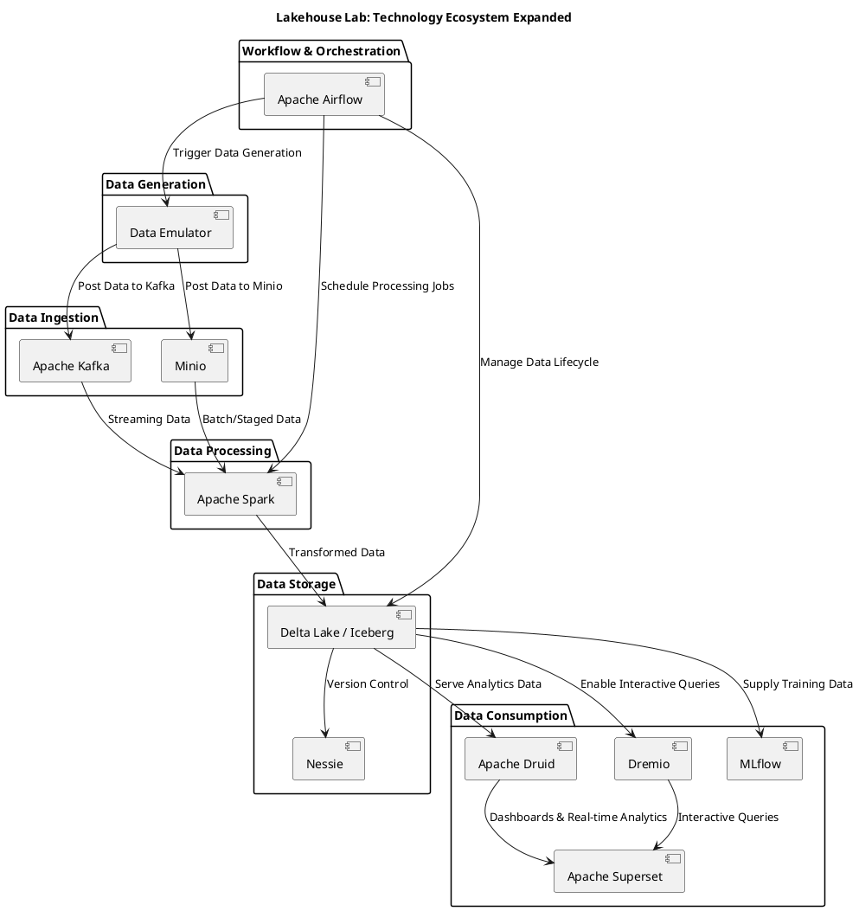

# Lakehouse Lab: A Modern Blueprint for End-to-End Data Engineering

In today’s rapidly evolving data landscape, organizations need more than just robust production systems—they need a secure, realistic lab where innovation can thrive without jeopardizing live environments. **Lakehouse Lab** is that dynamic playground where data architects, engineers, and ML practitioners can simulate end-to-end data workflows, experiment with cutting-edge technologies, and build production-grade solutions—all within a safe sandbox.

---

## Motivation and Project Objectives

In this data-driven era, robust, scalable, and efficient architectures are no longer optional—they’re essential. Organizations must juggle vast historical datasets alongside a continuous stream of real-time information. Yet, finding a secure environment to test and refine these systems is a constant challenge. That’s where Lakehouse Lab comes in.

- **Accelerated Skill Development:**
  By emulating enterprise-scale operations, Lakehouse Lab empowers you to explore innovative ingestion patterns, advanced data modeling, and sophisticated ETL strategies in a hands-on, real-world environment. This fast-tracks learning and deepens your expertise in today’s dynamic data ecosystems.

- **Authentic Data Simulations:**
  The platform creates synthetic data streams—ranging from simulated financial transactions to virtual IoT telemetry—that rigorously stress-test your pipelines for throughput, latency, and resilience. With Lakehouse Lab, you’re always prepared for the unpredictable nature of live environments.

- **Industry Best Practices in Action:**
  Leveraging top-tier tools such as _Apache Spark_, _Apache Kafka_, _Delta Lake/Iceberg_, and _Nessie_, Lakehouse Lab demonstrates not only how modern data lakehouses are built but also how to implement best practices in contemporary data engineering.

At its core, Lakehouse Lab is designed to empower you to experiment, iterate, and refine complex data pipelines in a risk-free setting—transforming theoretical ideas into tangible, production-ready applications.

---

## A 360° Journey Through Modern Data Engineering

Lakehouse Lab guides you through every stage of the data lifecycle—from ingestion to machine learning—by combining rigorous theory with practical, hands-on demonstrations.

- **Multi-Mode Data Ingestion:**
  The platform supports a variety of ingestion methods. It seamlessly integrates traditional batch processes, using file systems and cloud storage solutions like _Minio_, with agile, near-real-time event streaming powered by _Kafka_. This dual approach builds resilient data pipelines capable of adapting to fluctuating workloads.

- **Advanced ETL and Data Transformation:**
  With _Apache Spark_ at its core, Lakehouse Lab introduces modern ETL techniques. Discover dynamic partitioning, efficient broadcasting, and intelligent shuffling—all designed to ensure consistent performance, whether processing high-frequency streams or massive data backfills.

- **Real-Time Processing for Immediate Insights:**
  The combination of _Kafka_ with streaming tools such as Spark Structured Streaming or _Apache Druid_ unlocks near real-time analytics. This empowers rapid, data-driven decision-making in fast-changing environments.

- **Robust Data Governance and Quality:**
  Build your data on a solid foundation with dynamic schema evolution, rigorous validation frameworks (like Great Expectations), and comprehensive lineage tracking. These measures guarantee that your data remains reliable and compliant.

- **Modern Infrastructure & Seamless Orchestration:**
  Future-proof your operations using orchestration tools like _Apache Airflow_, containerization with _Docker_, and scalable deployments with Kubernetes. Lakehouse Lab provides the agile backbone that today’s production-grade systems demand.

- **End-to-End Machine Learning:**
  From data wrangling to model deployment, _MLflow_ integrates your entire machine learning lifecycle. The tight integration of ML into the overall data pipeline ensures that every stage—from experimentation to deployment—is synchronized and efficient.

Each component of Lakehouse Lab is designed not only to educate but also to empower, ensuring that you have both the theoretical and practical skills to excel in a rapidly changing data landscape.

---

## Architectural Overview

Lakehouse Lab is built on a flexible, modular pipeline that combines the proven benefits of a traditional data lakehouse with modern, scalable design principles. The architecture supports every stage—from realistic data simulation through to actionable analytics and machine learning—while maintaining resilience, fault tolerance, and flexibility.

**Overall Pipeline Architecture**

---

### 1. Emulator/Source

**Purpose:**
Our custom data factories generate realistic event streams—including synthetic device logs, financial transactions, and user profiles—that closely mimic real-world production conditions. Whether delivered to streaming or batch ingestion systems, these events rigorously test every aspect of your data pipeline.

**Key Considerations:**

- **Realism:**
  The emulator faithfully replicates both everyday activity and peak load scenarios, providing a stringent testing ground for system resilience.

- **Flexibility:**
  By generating diverse data types—such as device logs, transactions, and user profiles—the emulator supplies a versatile foundation that supports a wide range of data scenarios across both streaming and batch modes.

---

### 2. Ingestion Layer

**Core Technologies:**

- **Apache Kafka:**
  Provides high-throughput, low-latency streaming to efficiently handle real-time data.

- **Minio:**
  Acts as an S3-compatible storage solution that stages large volumes of raw data for batch processing.

**Design Features:**

- **Fault Tolerance:**
  Engineered to recover gracefully, ensuring data continuity without loss.

- **Scalability:**
  Seamlessly adapts to both on-premise and cloud environments, scaling as your data volumes grow.

**Benefits:**

- **Hybrid Approach:**
  Combines the immediacy of real-time streaming (via Kafka) with the reliability of batch ingestion (via Minio) for maximum flexibility and resilience.

**Detailed Ingestion Diagram**

---

### 3. Processing

**Technology Backbone:**
Powered by **Apache Spark**, the processing layer transforms both batch and streaming data into actionable insights.

**Key Processing Characteristics:**

- **Schema Enforcement:**
  Ensures that all incoming data adheres strictly to predefined structures, maintaining consistency across the pipeline.

- **Data Quality Validations:**
  Implements comprehensive checks to verify the accuracy and integrity of the data before further processing.

- **Transformation Flexibility:**
  From simple cleanses to complex aggregations and joins, Spark adeptly handles all types of transformations.

**Operational Insights:**

- **Real-Time Capabilities:**
  When combined with streaming ingestion, Spark delivers near real-time analytics that empower rapid, data-driven decision-making.

**Processing Flow Diagram**

---

### 4. Storage

**Storage Technologies:**

- **Delta Lake / Iceberg:**
  These modern table formats provide **ACID guarantees**, time travel capabilities, and dynamic schema evolution, ensuring reliable and high-performance storage.

- **Nessie:**
  Nessie is the Git for your data lake. It delivers robust version control—enabling branching, merging, and precise change tracking in your lakehouse storage. With fine-grained lineage and auditability, Nessie ensures seamless rollbacks, fosters collaborative development, and enforces strict compliance.

**Data Tiering Strategy:**

- **Bronze (Raw):** Holds unprocessed data.
- **Silver (Cleaned/Enriched):** Stores data after transformation and quality validation.
- **Gold (Analytics-Ready):** Contains curated datasets optimized for fast, reliable analytics.

**Benefits:**

- **Reliability:**
  ACID compliance and time travel in Delta Lake / Iceberg ensure data consistency and facilitate easy rollbacks.
- **Lifecycle Management:**
  A tiered strategy streamlines the progression from raw data to actionable insights.
- **Enhanced Governance with Nessie:**
  Nessie's unique capability to version and control data changes empowers teams to experiment, collaborate, and audit the data lifecycle seamlessly. It ensures that every change—be it schema evolution, data corrections, or historical trends—is properly recorded and can be reviewed or reversed if necessary.

**Data Tiering Diagram (Including Nessie)**

---

### Why Nessie Matters

By integrating Nessie, Lakehouse Lab gains a crucial layer of data governance and version control that is unique in today's data architectures:

- **Version Control for Data:**
  Like Git for source code, Nessie offers branching, merging, and history tracking for your data. This allows you to experiment without fear, knowing that you can always revert or compare different versions of your datasets.

- **Enhanced Collaboration:**
  Nessie facilitates collaboration among data engineers and scientists by managing concurrent changes, making it easier to integrate, review, and synchronize modifications across teams.

- **Improved Auditability and Compliance:**
  With full traceability of data changes, Nessie supports rigorous audit trails, enabling organizations to comply with regulatory requirements and ensuring data integrity over time.

- **Streamlined Data Evolution:**
  As datasets evolve through refinements and enhancements, Nessie ensures that these changes are captured systematically—providing a robust metadata layer that simplifies rollback, troubleshooting, and historical analysis.

---

### 5. Consumption

**End-User Technologies:**

- **BI & Analytics:**
  Tools like **Apache Superset**, **Dremio**, and **Apache Druid** empower you to build interactive dashboards and perform real‑time reporting.
- **Machine Learning:**
  **MLflow** ties together the entire machine learning lifecycle—from training to deployment.

**Consumption Pathways:**

- **Operational Dashboards:**
  Provide immediate, interactive insights for everyday decision-making.
- **Predictive Analytics:**
  Leverage both historical and real-time data to forecast future trends and outcomes.

**Unified Access:**
Data is transformed and curated before reaching end-user systems, ensuring that platforms like Apache Superset have a complete and accurate analytical view.

**Consumption Flow Diagram**

---

## Additional Diagrams and Insights

To provide a deeper understanding of the system, the following diagrams illustrate data flow, processing stages, and error handling:

### Sequence Diagram – Data Event Flow

This diagram shows the journey of a single data event from generation through transformation to consumption.

### Flowchart – Data Processing Pipeline

This flowchart captures the major processing stages from raw data ingestion to final delivery of actionable insights.

### Sequence Diagram – Error Handling

This diagram demonstrates how errors are managed within the processing pipeline.

---

## Architectural Rationale and Benefits

Lakehouse Lab’s layered design is more than just a collection of state-of-the-art technologies—it’s a strategic blueprint that delivers:

- **Modularity:**
  Every component, from data generation to consumption, is decoupled and replaceable, allowing the architecture to evolve seamlessly with new innovations.
- **Resilience:**
  With robust error handling, fault tolerance, and recovery mechanisms, the system is designed to maintain continuous data flow—even when issues arise.
- **Scalability:**
  The hybrid integration of batch and real-time ingestion ensures the system scales effortlessly to meet growing data demands across diverse workloads.

**Expanded Technology Ecosystem Diagram**

---
