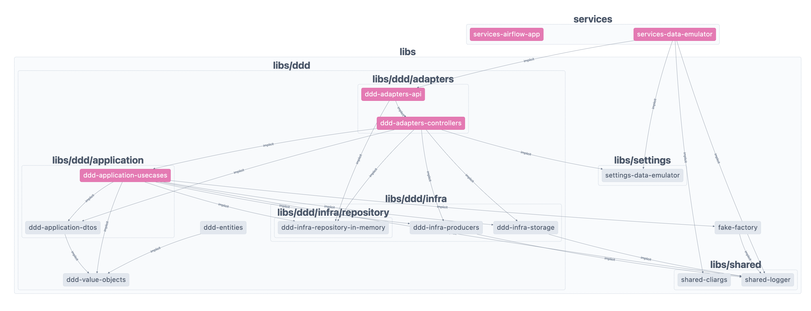
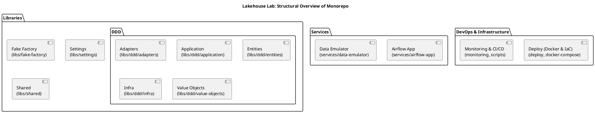
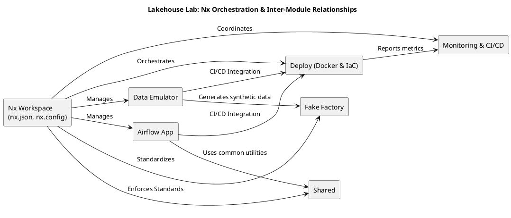

# Monorepos with Nx in Lakehouse Lab: Why and How

At Lakehouse Lab, our repository isn’t simply a collection of isolated projects—it’s a unified ecosystem that spans data emulation, ingestion, processing, storage, monitoring, and deployment. Consolidating these components into a single monorepo enables us to work in an integrated workspace where libraries have clearly defined scopes and dependency management is both transparent and concise. In this article, we explain why we chose a monorepo strategy for Lakehouse Lab, how Nx powers our workflow, and the tangible benefits we’ve realized.

---

## Why a Monorepo for Lakehouse Lab?

### Consolidating Complex Data Pipelines

The Lakehouse Lab repository is designed as a one-stop ecosystem that integrates all components critical to modern data engineering. By keeping everything in a single repository, every piece of the puzzle is immediately accessible, synchronized, and consistently maintained. Key elements include:

- **Services:**
  Core applications such as `services/airflow-app` (for workflow orchestration) and `services/data-emulator` (for synthetic data generation) form the backbone of our pipelines.

- **Libraries:**
  Under the `libs` directory, modules focused on domain-driven design (DDD), fake data factories, configuration settings, and shared utilities coexist. This layered architecture encourages code reuse and allows us to enforce closed scopes of responsibility for each library. Each team can work in the language best suited for the task (Python, TypeScript, Go, etc.), while clear dependency boundaries minimize accidental coupling.

- **DevOps & Infrastructure:**
  Directories like `deploy`, `monitoring`, and `scripts` encapsulate all deployment configurations, CI/CD pipelines, and infrastructure-as-code artifacts. This streamlined structure ensures every change is immediately reflected across production workflows.

- **Documentation:**
  A centralized `docs` folder provides guides, architectural overviews, and onboarding materials—making it easier for new team members to quickly understand and contribute to the ecosystem.

### Eliminating Cross-Repository Overhead

A monorepo minimizes overheads typically encountered with managing multiple repositories by:

- **Enforcing Consistent Coding Practices:**
  With a single repository, uniform standards, testing frameworks, and build configurations are applied throughout, which greatly improves code quality and simplifies maintenance.

- **Enhancing Collaboration:**
  When data engineers, machine learning specialists, and DevOps teams work within the same codebase, knowledge sharing happens more naturally, and troubleshooting becomes faster due to transparent workflows.

- **Enabling Atomic and Synchronized Changes:**
  Atomic commits across multiple modules ensure that updates (from global configuration changes to extensive refactoring) are synchronized throughout the repository, reducing version conflicts and integration issues.

---

## How Nx Empowers Our Monorepo Strategy

Nx is much more than a repository manager—it is a comprehensive toolkit that brings structure, efficiency, and scalability to our monorepo. Here’s how Nx transforms our workflow at Lakehouse Lab:

### Enabling a Clean and Concise Workspace

- **Scoped Libraries:**
  Nx helps us enforce clear boundaries between libraries by encouraging a closed-scope design. Each library is responsible for a specific domain of our application, making dependency management straightforward and avoiding unintended cross-cutting concerns.

- **Clear Dependency Management:**
  With Nx, every module’s dependencies are visually mapped and strictly controlled. This transparency not only simplifies maintenance but also accelerates collaboration across teams.

### Advanced Features in Action

- **Advanced Dependency Graph:**
  Nx automatically visualizes interdependencies across projects. When you update a shared utility in `libs/shared` or a configuration module in `libs/settings`, the dependency graph reveals the ripple effects throughout the repository. This clarity is vital for safe refactoring and informed decision-making. You can even explore our interactive dependency graph [here](https://fabiocaffarello.github.io/lakehouse-lab/dependency-graph/index.html?select=all#/projects/all?groupByFolder=true).

- **Incremental Builds and Tests:**
  Rather than rebuilding the entire codebase for every change, Nx intelligently caches outputs and tracks affected projects at a granular level. Commands like `nx affected:build` and `nx affected:test` ensure that only the modules impacted by recent changes are rebuilt or retested. This dramatically reduces build times and accelerates the development cycle.

- **Integrated Task Orchestration and Consistent Code Generation:**
  Nx’s built-in task runner coordinates complex workflows—testing, linting, and deployment—ensuring that tasks run in the correct order and parallelize whenever possible. Additionally, its powerful code generators and schematics enable developers to quickly scaffold new applications and libraries that adhere to best practices, minimizing onboarding friction.

- **Exploring the Nx Affected Feature:**
  One of Nx’s most powerful capabilities is identifying and visualizing the projects affected by recent changes in your monorepo. Rather than rebuilding or retesting everything, Nx enables targeted operations, such as:

- **nx affected:test** – Runs tests only for modified projects and their dependents.
- **nx affected:lint** – Applies lint checks only where they’re needed.
- **nx affected:build** – Rebuilds only the relevant modules.
- **nx affected:image** – Creates container images solely for changed projects.

This selective approach optimizes your CI/CD pipeline by reducing build times and resource consumption. The screenshot below illustrates an “affected” graph generated by running:

```bash
npx nx graph --affected
```



In this visual representation, only the projects impacted by your recent commits appear highlighted, along with their direct or indirect dependencies. You can immediately see which modules need attention and focus your efforts accordingly. By zeroing in on just the affected projects, you streamline your workflow, shorten feedback loops, and keep the entire development process more efficient.

### Visualizing the Monorepo Structure

#### 1. Structural Overview of the Monorepo

This diagram categorizes our repository into Services, Libraries, and DevOps & Infrastructure.



#### 2. Nx Orchestration and Inter-Module Relationships

This diagram details how Nx orchestrates core processes and integrations across modules.



---

## The Impact on Lakehouse Lab

Nx has transformed the way we develop and deploy our systems:

- **Enhanced Developer Productivity:**
  Unified workflows, closed-scope libraries, and incremental builds allow developers to navigate and modify interconnected components swiftly, reducing downtime and speeding up development.

- **Stronger Consistency and Quality:**
  A single repository ensures uniform coding practices and immediate propagation of shared changes, which minimizes integration friction and maintains high code quality.

- **Efficient, Scalable Workflows:**
  Intelligent dependency tracking and the “affected” feature keep build and test cycles lean, enabling scalable development as the repository grows.

With Nx at the core of our monorepo, every code change becomes part of a cohesive ecosystem, streamlining development while laying a robust foundation for future innovation.

---

## Practical Benefits Realized in Lakehouse Lab

### Enhanced Developer Productivity

- **Unified Workflows:**
  Developers work seamlessly across services and libraries, accelerating onboarding and fostering collaboration.
- **Efficient Integration:**
  Immediate propagation of shared changes minimizes version drift and synchronizes development across all modules.

### Agile and Consistent Delivery

- **Faster Builds and Tests:**
  Incremental builds and targeted testing—especially with the “affected” feature—significantly cut build times.
- **Robust Task Scheduling:**
  Automated, dependency-aware orchestration ensures that builds, tests, and deployments run smoothly, reinforcing high-quality code.

### Scalability for Complex Data Ecosystems

As Lakehouse Lab evolves with new microservices, libraries, and infrastructure enhancements, our Nx-managed monorepo scales effortlessly, meeting growing data demands without sacrificing stability or efficiency.

---
