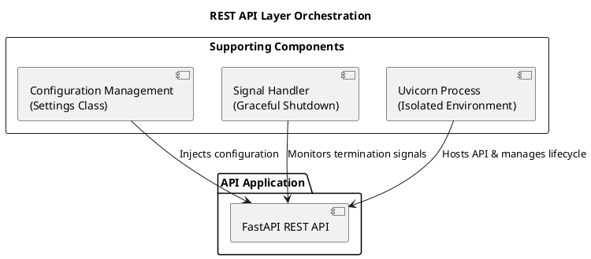
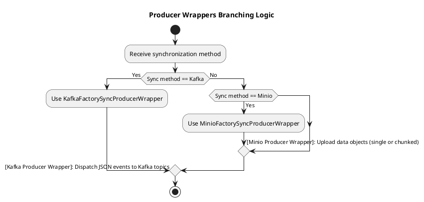
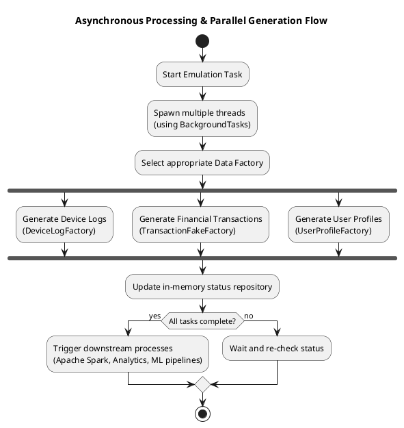
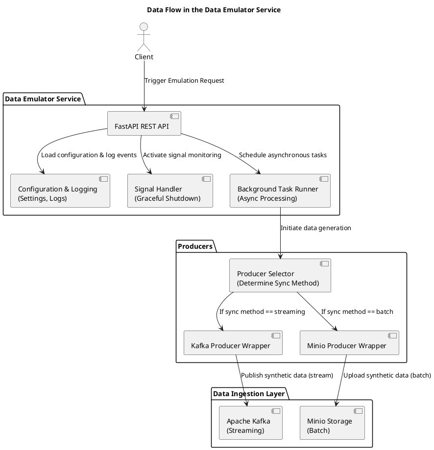
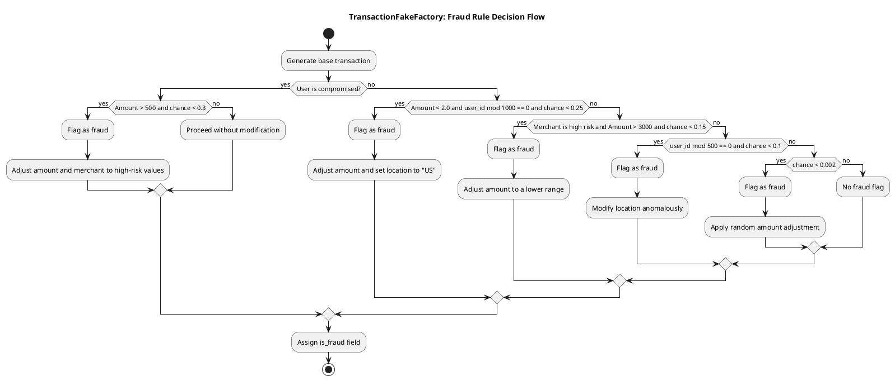
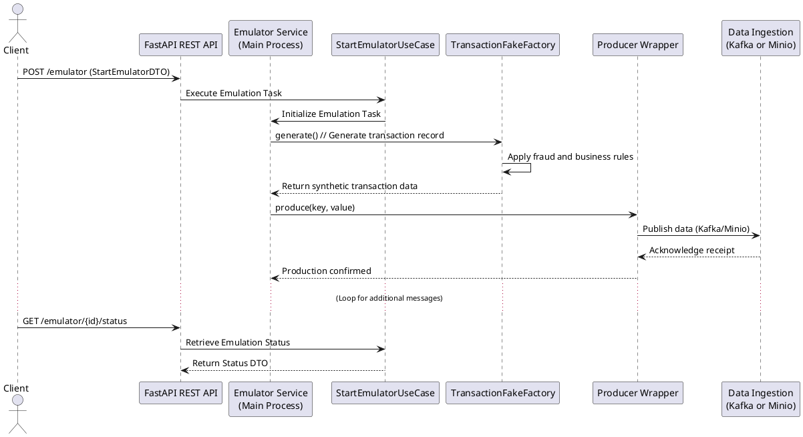
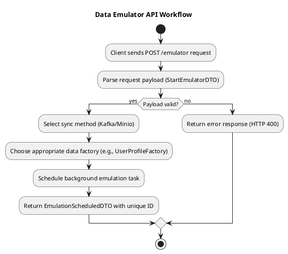

# Data Emulator Service in Lakehouse Lab: An Architectural Deep Dive

In today’s complex data ecosystems, validating pipelines with realistic, production-grade data is critical before deployment. As experienced data architects, we know that rigorous testing is the cornerstone of operational excellence. At Lakehouse Lab, our Data Emulator Service is engineered to generate synthetic data that mirrors real-world scenarios—from financial transactions and device logs to comprehensive user profiles. This article provides an in-depth exploration of the Data Emulator Service, detailing its architectural design, key components, and how it supports both streaming and batch ingestion pipelines.

---

## Why a Data Emulator Is Essential

### Bridging Simulation and Production

Real-world data is unpredictable—it features surges, anomalies, and a wide spectrum of conditions that static datasets simply cannot capture. Relying solely on sanitized, static data can mask critical issues, resulting in unexpected bottlenecks and failures when systems go live. Our Data Emulator Service overcomes these challenges by:

- **Simulating Real-World Variability:**
  It continuously produces dynamic synthetic data streams that replicate everyday operations and rare edge-case scenarios, rigorously stressing both ingestion and processing pipelines.

- **Enabling Continuous Experimentation:**
  By generating production-like data on an ongoing basis, our service empowers teams to iterate on data models, refine ETL processes, and experiment with complex machine learning algorithms without impacting live systems.

- **Validating End-to-End Workflows:**
  The emulator supplies realistic inputs at every stage—from ingestion through processing, storage, and analytics—ensuring that the entire data pipeline is primed to handle the unpredictability of real-world data.

_Print Opportunity:_
Include a visual that contrasts static test datasets with dynamic, synthetic production-like data to highlight the importance of realistic data simulation.

---

## System Architecture Overview

Our Data Emulator Service is built with modularity, resilience, and scalability in mind—principles that guide every decision we make. The architecture is structured around three key pillars, each addressing a critical component of the system's operation.

### 1. REST API and Service Orchestration

At the heart of the service is a robust REST API, built with FastAPI. This API is the primary interface for triggering, monitoring, and managing emulation tasks. Deployment in an isolated Uvicorn process enhances resilience and simplifies lifecycle management. Supporting this core functionality are several critical components:

- **Centralized Configuration:**
  A custom `Settings` class aggregates configuration from environment variables and command-line arguments. This ensures that critical parameters (e.g., Kafka and Minio credentials) are consistently injected into the application.

- **Graceful Signal Handling:**
  An asynchronous `SignalHandler` listens for termination signals (such as SIGINT and SIGTERM) and orchestrates a controlled shutdown of the API and background tasks, preventing data loss and ensuring proper resource cleanup.

Below is a diagram that visualizes how these components interact:



_Diagram Annotation:_

- **FastAPI REST API:** Main endpoint for client requests.
- **Configuration Management:** Ensures consistency in configuration values across the system.
- **Signal Handler:** Manages shutdown sequences to ensure smooth termination.
- **Uvicorn Process:** Hosts the FastAPI application in an isolated, resilient environment.

---

### 2. Data Generation with Producer Wrappers

Our Data Emulator Service employs a factory-based mechanism to generate synthetic data through various producer wrappers. This design enables the system to select the most suitable producer at runtime—either **Kafka** for real-time streaming or **Minio** for batch mode—thereby decoupling core business logic from the data publishing process.

- **Producer Abstraction:**
  A factory pattern underpins this abstraction, receiving synchronization parameters from the incoming request (e.g., “Kafka” or “Minio”) and returning the correct producer wrapper. By cleanly separating publishing strategies, the service gains exceptional flexibility and maintainability.

- **Kafka Integration:**
  When configured for streaming, the `KafkaFactorySyncProducerWrapper` is used to dispatch JSON-formatted synthetic events directly to Kafka topics. This approach is optimized for low-latency, high-throughput data pipelines, ensuring that downstream consumers receive updates in near real-time.

- **Minio Integration:**
  For batch-oriented scenarios, the `MinioFactorySyncProducerWrapper` manages the uploading of synthetic data as objects into Minio. Whether uploading single records or handling large, chunked backfills, this wrapper ensures robust batch processing for later ingestion and analysis.

#### Producer Wrappers Branching Logic



**Diagram Annotation:**

- **Start:** The system receives the desired synchronization method (e.g., “Kafka” or “Minio”).
- **Branching Decision:**
    - **Kafka Producer:** If the mode is “streaming,” JSON-formatted synthetic events are immediately dispatched to Kafka topics.
    - **Minio Producer:** If the mode is “batch,” synthetic data objects—either single or chunked—are uploaded to Minio.
- **End:** The chosen producer executes the data publishing accordingly.

---

### Real-World Example: Producer Selection in Action

Below is a screenshot captured from a live environment, demonstrating how the Data Emulator’s logs reveal both the branching logic and the resulting published data:


**Screenshot Highlights:**

- **CLI Commands:** The upper portion shows a sample `curl` command specifying `"emulator_sync": "grouped", "emulation_domain": "user-profile"` and other parameters. These parameters drive the decision to use Minio for batch uploads and specify the shape and size of the dataset.
- **Log Messages:** The logs reflect how the service identifies the correct producer, spawns threads for parallel data generation, and posts confirmation messages such as `Produced message` or `Emulation finished`. These details offer a transparent look into the background tasks orchestrated by the Data Emulator.

---

### 3. Asynchronous Processing and Parallel Generation

To simulate the high-throughput conditions typical of production systems, the Data Emulator Service leverages asynchronous processing and parallel generation. This ensures that synthetic data is generated concurrently, providing a realistic stress test for downstream pipelines.

- **Concurrent Data Production:**
  The service spawns multiple threads using FastAPI’s BackgroundTasks, generating synthetic data concurrently. This simulates a high-load environment, allowing us to mimic the performance characteristics of real-world systems.

- **Specialized Data Factories:**
  Based on the emulation domain, the service dynamically selects a dedicated factory to generate the appropriate synthetic data:

    - **DeviceLogFactory:** Generates detailed device logs capturing user, device, and session information.
    - **TransactionFakeFactory:** Produces synthetic financial transactions enriched with robust fraud-detection logic.
    - **UserProfileFactory:** Creates comprehensive user profiles including demographic details and risk assessments.

- **Resource and Status Management:**
  An in-memory repository tracks the progress and status of each task at a granular level. This ensures that once data generation completes, downstream processes—such as Apache Spark jobs, analytics, and ML pipelines—are triggered without delay.

Below is a refined flowchart that visually encapsulates the asynchronous data generation process:



_Diagram Annotation:_

- **Initialization:** The emulation task is initiated and multiple background tasks are spawned.
- **Data Generation:** Specialized factories operate concurrently to generate different types of synthetic data.
- **Status Management:** An in-memory repository tracks each thread’s progress.
- **Triggering Downstream Processes:** Once all tasks are complete, further processing (e.g., Spark jobs, analytics) is initiated.

---

## Data Flow Overview

The following enhanced diagram illustrates the comprehensive data flow within the Data Emulator Service as it integrates into Lakehouse Lab’s broader pipeline. The diagram details every stage—from client request to configuration, task scheduling, dynamic producer selection, and final data ingestion.



_Diagram Annotation:_

- **Client:** Initiates the emulation process.
- **Data Emulator Service:** Handles configuration, logging, signal management, and schedules background tasks.
- **Producers:** Use a selector to dynamically choose either Kafka (for streaming) or Minio (for batch processing) based on the synchronization method.
- **Data Ingestion Layer:** Receives the synthetic data for further downstream processing.

---

## In-Depth Look at Data Factories

Our Data Emulator Service utilizes specialized factories to generate realistic synthetic data, each adhering to specific business rules:

### DeviceLogFactory

**Purpose:**
Generates synthetic device logs capturing details such as user ID, device type, operating system, network information, and session duration.

**Key Fields:**

- `log_id`, `user_id`, `device_id`
- `device_type` (e.g., mobile, desktop, tablet)
- `os` (e.g., Windows, macOS, Linux)
- `ip_address`, `location`
- `user_agent`
- `login_timestamp`, with an optional `logout_timestamp`

**Operation:**
Simulates user sessions by generating a login timestamp within the last hour and conditionally creating a logout timestamp (70% chance) to mimic variable session durations.

### TransactionFakeFactory

**Purpose:**
Produces synthetic financial transactions, incorporating advanced fraud-detection logic to simulate anomalies.

**Key Fields:**

- `transaction_id`, `user_id`, `amount`, `currency`
- `merchant`, `timestamp`, `location`
- `is_fraud` flag

**Business Rules:**
Evaluates transactions under multiple conditions:

- **Account Takeover:** Flags high-amount transactions with a 30% chance for compromised users.
- **Card Testing:** Detects patterns in low-amount transactions.
- **Merchant Collusion:** Flags transactions from high-risk merchants when amounts are substantial.
- **Geographical Anomalies:** Modifies location values based on user patterns.
- **Random Fraud:** Applies a minimal baseline fraud probability.

#### Fraud Rule Decision Flowchart



### UserProfileFactory

**Purpose:**
Generates synthetic user profiles enriched with demographic details and risk assessments.

**Key Fields:**

- `user_id`, `name`, `email`, `phone`
- `date_of_birth`, `address`, `country`
- `signup_date`, `credit_score`
- `risk_level` (derived from credit score, demographics, and sign-up recency)

**Operation:**
Ensures unique user IDs via a thread-safe mechanism and produces detailed profiles with calculated risk levels based on predefined criteria.

---

## End-to-End Data Emulation Workflow

The sequence diagram below outlines the complete operation of the Data Emulator Service—from the client triggering an emulation to data generation and subsequent ingestion.



_Annotation:_

- **Task Initialization:** The emulation task is triggered and initialized.
- **Data Generation:** Specialized factories, such as TransactionFakeFactory, apply business rules to generate synthetic data.
- **Data Publishing:** The producer wrapper dispatches data to the appropriate ingestion layer.
- **Status Tracking:** Clients can query the status of emulation tasks via the API.

---

## API Workflow: Example Request Processing

The Data Emulator Service exposes a RESTful API for managing emulation tasks. Below is an example using `curl` to trigger an emulation for user profiles:

```bash
curl -X 'POST' 'http://localhost:8000/emulator/' \
  -H 'Content-Type: application/json' \
  -d '{"emulator_sync": "minio", "emulation_domain": "user-profile", "timeout": 1, "format_type": "json", "sync_type": "grouped", "max_chunk_size": 1024}'
```

### Flowchart: API Request Processing



**Annotation:**

- **Payload Reception and Validation:**
  The process begins when the client sends a POST request to the `/emulator` endpoint. The API parses the request payload (StartEmulatorDTO) and performs validation, ensuring all required fields and parameters are present and correct. This step is crucial to avoid processing invalid or incomplete requests.

- **Dynamic Producer Selection:**
  Upon successful payload validation, the system determines the appropriate synchronization method. Based on this decision—whether to use real-time streaming via Kafka or batch processing via Minio—the service dynamically selects the corresponding producer wrapper. For example, if the sync method is Kafka, the `KafkaFactorySyncProducerWrapper` is employed; if it is Minio, then the `MinioFactorySyncProducerWrapper` is chosen.

- **Task Scheduling:**
  Once the synchronization method is set and the appropriate data factory is chosen (e.g., UserProfileFactory for user-profile data), the service schedules the data generation task. This is managed asynchronously using FastAPI's BackgroundTasks, allowing the system to spawn multiple threads that generate synthetic data concurrently, simulating a high-throughput environment.

- **Status Tracking and Response:**
  As tasks run in the background, the service maintains an in-memory status repository to track the progress of each task at a granular level. This ensures that, once data generation completes, downstream processes—such as Apache Spark jobs, analytics, or ML pipelines—are triggered promptly. Finally, the API returns a unique EmulationScheduledDTO with an ID that the client can use to query the task status later.

---

## Additional Resources: Swagger/OpenAPI Documentation

For a comprehensive look at our Data Emulator Service API, explore our interactive Swagger documentation. This detailed OpenAPI resource covers every endpoint, parameter, and response model, making it an invaluable tool for testing and integration.

**Access the Swagger Documentation:**
[Data Emulator Service OpenAPI Documentation](https://fabiocaffarello.github.io/lakehouse-lab/reference/services/data-emulator/openapi/)

---

## Conclusion

Our Data Emulator Service is a cornerstone of the Lakehouse Lab architecture—providing a secure, realistic environment for rigorous testing and innovation across the data pipeline. By generating synthetic data that mirrors complex real-world scenarios and applying sophisticated business logic, the service bridges the gap between simulation and production. This ensures that each phase—from ingestion and processing to storage and analytics—is robustly validated.

In this architectural deep dive, we have covered:

- **The Need for a Data Emulator:** How dynamic, production-like data ensures system robustness.
- **Core Architectural Components:** An overview of our REST API, producer abstractions, and parallel data generation.
- **In-Depth Data Factory Logic:** Detailed explanations and flowcharts for generating synthetic device logs, transactions, and user profiles.
- **Comprehensive Visualizations:** Sequence diagrams, flowcharts, and PlantUML illustrations that capture the data flow and process orchestration.
- **API Documentation:** Direct access to our Swagger/OpenAPI documentation for further exploration.

As our series continues, future articles will explore how this synthetic data is processed by Apache Spark, visualized in real-time dashboards, and leveraged to power advanced ML/AI pipelines. We welcome your feedback and look forward to sharing more insights and best practices as we push the boundaries of modern data architecture.

---
