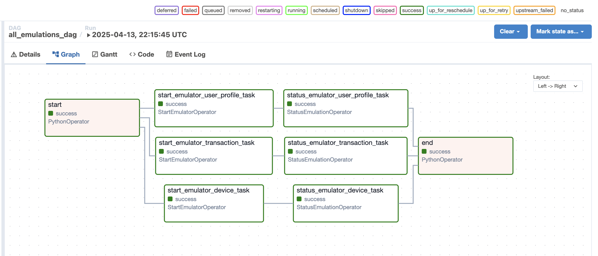
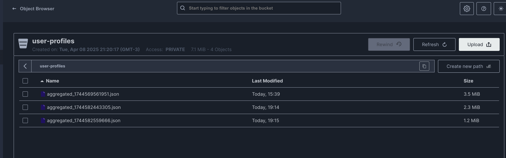
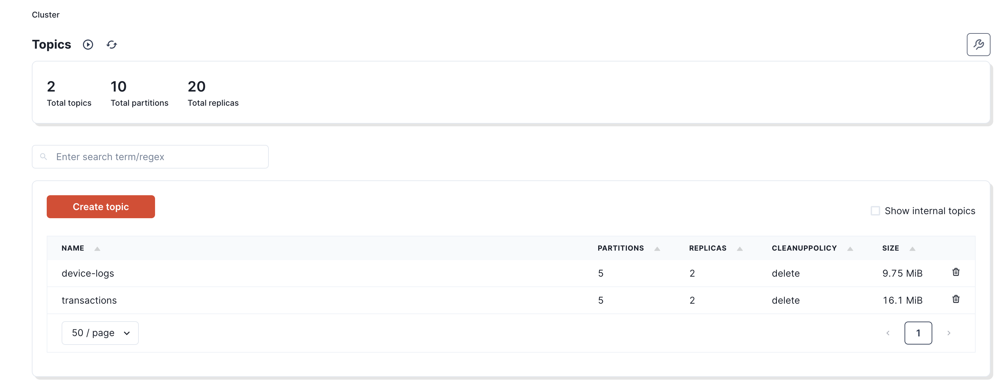

# Orchestrating Data Emulation with Airflow in Lakehouse Lab

In modern data engineering, the ability to automate and orchestrate complex workflows is essential to maintaining system robustness and agility. At Lakehouse Lab, we have harnessed the power of Apache Airflow to streamline our data emulation processes—enabling us to simulate realistic data scenarios across multiple domains. This orchestration not only validates our end-to-end pipelines but also lays a solid foundation for downstream processing with Apache Spark, real‑time analytics, and advanced ML/AI frameworks.

---

## The Strategic Role of Airflow in Our Ecosystem

Airflow is at the heart of our data orchestration strategy. With its scalable, flexible, and modular design, it allows us to manage complex pipelines with precision. In our environment, Airflow serves three critical functions:

- **Triggering Data Emulation:**
  Airflow initiates synthetic data generation by invoking our Data Emulator Service via custom REST API calls. This automated triggering ensures that our system is continuously stress-tested under conditions that mimic production.

- **Monitoring Emulation Status:**
  Once a task is triggered, Airflow diligently polls the Data Emulator Service to monitor progress. By ensuring that emulation tasks are completed successfully before subsequent steps are executed, we maintain the integrity of our data pipeline.

- **Managing Dependencies and Error Handling:**
  Custom operators enforce strict execution order and effectively manage retries and errors, thereby guaranteeing that interdependent tasks are coordinated seamlessly. This tight orchestration minimizes the risk of cascading failures.

---

## Custom Operators: The Backbone of Our Workflow

To integrate the Data Emulator Service within our Airflow ecosystem, we developed two purpose-built custom operators. These operators encapsulate our core orchestration logic, ensuring robust and predictable workflow execution.

### 1. StartEmulatorOperator

**Purpose:**
This operator initiates the data emulation process by sending a POST request to our Data Emulator Service’s REST API.

**Key Responsibilities:**

- **Parameter Handling:**
  Accepts critical parameters such as synchronization method (e.g., Kafka for streaming, Minio for batch), emulation domain (e.g., user-profile, device-log, transaction), and additional formatting options (format type, sync type, maximum chunk size, timeout).

- **Emulation Trigger:**
  Sends a well-defined payload to the emulator and retrieves a unique emulation ID, which is then pushed to Airflow’s XCom for further processing.

_High-Level Logic Sample:_

```python
payload = {emulator_sync, emulation_domain, format_type, sync_type, max_chunk_size, timeout}
response = POST(emulator_endpoint, payload)
if response is successful:
    emulation_id = response["id"]
    return emulation_id
else:
    raise error
```

### 2. StatusEmulationOperator

**Purpose:**
This operator continuously monitors the status of an ongoing emulation task by polling the Data Emulator Service until it confirms completion.

**Key Responsibilities:**

- **Polling Mechanism:**
  Retrieves the emulation ID from XCom and periodically issues GET requests to the status endpoint.

- **Completion Verification:**
  Continues polling until the task status returns “completed” or a timeout is reached, then returns the final status to the workflow.

_High-Level Logic Sample:_

```python
emulation_id = retrieve from XCom
while retry_count < max_retries:
    status = GET(status_endpoint/emulation_id)
    if status == "completed":
        return emulation_id
    else:
        wait for poll_interval
raise timeout error if not completed
```

---

## Constructing a Multi-Domain Emulation DAG

Our DAG is architected to orchestrate multiple emulation tasks concurrently—each representing a distinct data domain. This multi-domain approach not only accelerates our testing cycle but also verifies that our system can handle diverse, simultaneous workloads.

### DAG Workflow Overview

- **Start Task:**
  A simple PythonOperator logs the beginning of the workflow.

- **Domain-Specific Emulation Tasks:**
  Separate StartEmulatorOperators trigger emulation for user profiles, device logs, and transactions. Each task is paired with its corresponding StatusEmulationOperator, ensuring that downstream processing is only initiated upon successful completion.

- **End Task:**
  A concluding PythonOperator logs the completion of all tasks, signaling a successful run.

### Example DAG Code

```python
import airflow
from airflow import DAG
from airflow.operators.python import PythonOperator
from start_emulator_operator import StartEmulatorOperator
from status_emulation_operator import StatusEmulationOperator

dag = DAG(
    dag_id="all_emulations_dag",
    default_args={
        "owner": "Fabio Caffarello",
        "start_date": airflow.utils.dates.days_ago(1),
    },
    schedule_interval="@daily",
)

start = PythonOperator(
    task_id="start",
    python_callable=lambda: print("Jobs started"),
    dag=dag,
)

start_emulator_user_profile = StartEmulatorOperator(
    task_id="start_emulator_user_profile_task",
    endpoint="http://data-emulator:8000/emulator/",
    emulator_sync="minio",
    emulation_domain="user-profile",
    format_type="json",
    sync_type="grouped",
    max_chunk_size=1024,
    timeout=30,
    dag=dag,
)

status_emulation_user_profile = StatusEmulationOperator(
    task_id="status_emulator_user_profile_task",
    endpoint="http://data-emulator:8000/emulator/{}/status",
    prev_task_id="start_emulator_user_profile_task",
    dag=dag,
)

start_emulator_device = StartEmulatorOperator(
    task_id="start_emulator_device_task",
    endpoint="http://data-emulator:8000/emulator/",
    emulator_sync="kafka",
    emulation_domain="device-log",
    format_type="json",
    sync_type="grouped",
    max_chunk_size=1024,
    timeout=60,
    dag=dag,
)

status_emulation_device = StatusEmulationOperator(
    task_id="status_emulator_device_task",
    endpoint="http://data-emulator:8000/emulator/{}/status",
    prev_task_id="start_emulator_device_task",
    dag=dag,
)

start_emulator_transaction = StartEmulatorOperator(
    task_id="start_emulator_transaction_task",
    endpoint="http://data-emulator:8000/emulator/",
    emulator_sync="kafka",
    emulation_domain="transaction",
    format_type="json",
    sync_type="grouped",
    max_chunk_size=1024,
    timeout=60,
    dag=dag,
)

status_emulation_transaction = StatusEmulationOperator(
    task_id="status_emulator_transaction_task",
    endpoint="http://data-emulator:8000/emulator/{}/status",
    prev_task_id="start_emulator_transaction_task",
    dag=dag,
)

end = PythonOperator(
    task_id="end",
    python_callable=lambda: print("Jobs completed successfully"),
    dag=dag,
)

start >> start_emulator_user_profile >> status_emulation_user_profile
start >> start_emulator_device >> status_emulation_device
start >> start_emulator_transaction >> status_emulation_transaction
status_emulation_user_profile >> end
status_emulation_device >> end
status_emulation_transaction >> end
```

### Visual Representation

Below are several screenshots captured from our production environment:

- **Figure 1: Airflow DAG Graph**
  

- **Figure 2: Minio Interface**
  

- **Figure 3: Redpanda (Kafka) Interface**
  

_Diagram Annotation:_

- The DAG graph shows multiple domain-specific emulation tasks executing concurrently.
- Each task triggers a corresponding status check, ensuring robust validation before completion.
- The screenshots from Minio and Redpanda illustrate real-time data flow into our ingestion systems.

---

## Conclusion

Apache Airflow is a cornerstone in our Lakehouse Lab, orchestrating data emulation with unmatched precision. Through custom operators and a meticulously constructed multi-domain DAG, we seamlessly trigger, monitor, and manage the generation of synthetic data. This orchestration validates our data pipelines end-to-end—from ingestion and processing to storage and advanced analytics—ensuring that every component is robust, scalable, and production-ready.
